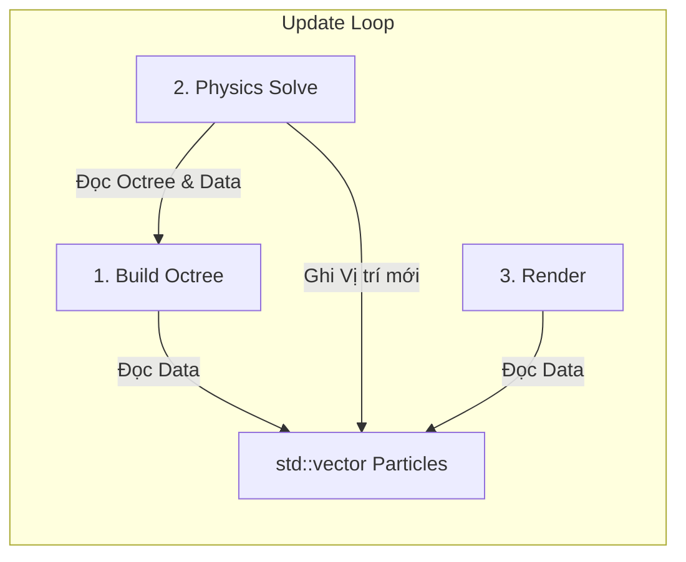

# 🌌 Gravity Simulation with Octree (Barnes-Hut)

Chào mừng đến với dự án mô phỏng trọng lực N-Body sử dụng thuật toán Barnes-Hut và cấu trúc dữ liệu Octree.

**Công nghệ sử dụng:**
*   **Ngôn ngữ**: C++20
*   **Kiến trúc**: Data-Oriented Design (DOD)
*   **Đồ họa**: Raylib
*   **Toán học**: GLM
*   **Build System**: CMake + vcpkg

---

## 🏛️ 1. Kiến trúc & Luồng hoạt động (Data-Oriented Design)

Dự án áp dụng tư duy **Data-Oriented Design (DOD)** để tối ưu hiệu năng cho hàng ngàn hạt. Chúng ta tách biệt hoàn toàn Dữ liệu và Logic.

### 1.1. Tổ chức Dữ liệu (Data Layout)
*   **`Particle` (POD)**: Chỉ là struct chứa dữ liệu (`pos`, `vel`, `acc`, `mass`). Không có hàm xử lý bên trong.
*   **`std::vector<Particle>`**: Mảng chứa tất cả các hạt, nằm liên tiếp trong bộ nhớ để tối ưu CPU Cache.
*   **`Octree`**: Cấu trúc không gian, được **xây dựng lại hoàn toàn (Rebuild)** mỗi khung hình từ mảng hạt.

### 1.2. Luồng chạy (The Pipeline)
Mỗi khung hình (Frame) là một dây chuyền xử lý dữ liệu qua các Hệ thống (Systems):



1.  **Build Octree System**: Đọc vị trí hạt -> Xây dựng cây -> Tính khối tâm (Center of Mass).
2.  **Physics System**: Duyệt mảng hạt -> Dùng Octree tính lực -> Cập nhật Vận tốc & Vị trí.
3.  **Render System**: Đọc mảng hạt -> Vẽ lên màn hình.

---

## 📂 2. Cấu trúc Dự án & Nhiệm vụ File (Encyclopedia)

### 🏗️ Root Directory
*   `CMakeLists.txt`: File cấu hình build chính. Đã thiết lập C++20 và tích hợp vcpkg.
*   `vcpkg.json`: Khai báo thư viện (`raylib`, `glm`, `gtest`). CMake tự động cài các thư viện này.
*   `.gitignore`: Loại bỏ file rác (build folder, file tạm).

### 💻 Source Code (`src/`)

#### 🔹 Core (`src/Core/`) - *Dữ liệu nền tảng*
*   `Particle.hpp`: Struct `Particle` (POD). Chỉ chứa dữ liệu, không logic.
*   `MathTypes.hpp`: Các định nghĩa toán học bổ trợ (nếu cần ngoài GLM).
*   `Allocator.hpp`: (Optional) Memory Pool nếu cần tối ưu cấp phát node cho Octree.

#### 🔹 Structure (`src/Structure/`) - *Cấu trúc không gian*
*   `Octree.hpp`: Cài đặt cây bát phân. Chứa logic chèn hạt và tính khối tâm.
*   `AABB.hpp`: Axis-Aligned Bounding Box - Hộp giới hạn không gian.

#### 🔹 Physics (`src/Physics/`) - *Hệ thống Vật lý*
*   `ISolver.hpp`: Interface chung.
*   `BarnesHutSolver.cpp`: Hệ thống tính lực O(N log N). Nhận vào `vector<Particle>` và `Octree`.
*   `BruteForceSolver.cpp`: Hệ thống tính lực O(N^2) để kiểm chứng kết quả.

#### 🔹 Graphics (`src/Graphics/`) - *Hệ thống Hiển thị*
*   `Renderer.hpp`: Wrapper quanh Raylib để vẽ các hạt và UI.
*   `Camera.hpp`: Điều khiển Camera 3D.

#### 🔹 Utils (`src/Utils/`) - *Tiện ích*
*   `GalaxyGenerator.cpp`: Hệ thống khởi tạo. Sinh dữ liệu hạt ban đầu (xoắn ốc, cầu...).
*   `Timer.hpp`: Đo FPS và thời gian xử lý vật lý.

#### 🔹 Main
*   `main.cpp`: Entry Point. Khởi tạo cửa sổ và chạy vòng lặp chính (Pipeline).

---

## 🚀 3. Hướng dẫn Cài đặt & Build (Từ con số 0)

Dành cho người mới bắt đầu, chưa có môi trường phát triển.

### Bước 1: Cài đặt Công cụ (Chỉ làm 1 lần)
1.  **Visual Studio 2022** (Khuyên dùng):
    *   Tải bản Community. Khi cài, tích chọn **"Desktop development with C++"**.
2.  **Git**: Tải và cài đặt Git.
3.  **vcpkg** (Quản lý thư viện):
    *   Mở thư mục ổ `C:/`.
    *   Mở Terminal (CMD/PowerShell) và chạy:
        ```cmd
        git clone https://github.com/microsoft/vcpkg
        cd vcpkg
        .\bootstrap-vcpkg.bat
        ```
    *   *Lưu ý:* Cần cài đúng tại `C:/vcpkg` để CMake tự nhận diện.

### Bước 2: Tải và Build Dự án
1.  **Clone code về máy**:
    ```bash
    git clone <link-repo>
    cd Gravity-with-octagonal-tree
    ```

2.  **Cấu hình CMake**:
    *   Mở folder dự án bằng VS Code.
    *   VS Code sẽ hỏi chọn Kit. Chọn **Visual Studio Community 2022 Release - amd64**.
    *   CMake sẽ tự động chạy và tải thư viện (raylib, glm...).
    *   *Nếu cần chạy lệnh thủ công:*
        ```bash
        cmake -B build -S . -DCMAKE_TOOLCHAIN_FILE="C:/vcpkg/scripts/buildsystems/vcpkg.cmake"
        ```

3.  **Build**:
    *   Bấm nút **Build** trên thanh trạng thái dưới đáy VS Code, hoặc chạy:
        ```bash
        cmake --build build --config Release
        ```


