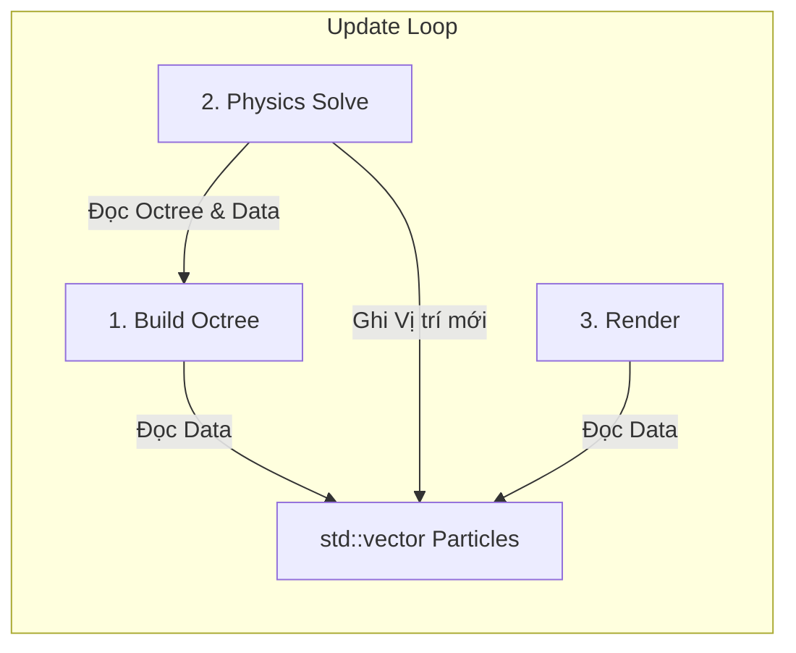

# Kiến trúc & Luồng hoạt động (Data-Oriented Design)

Tài liệu này mô tả kiến trúc hướng dữ liệu (DOD) của dự án. Chúng ta tách biệt hoàn toàn Dữ liệu (Data) và Logic (Systems).

## 1. Tổ chức Dữ liệu (Data Layout)

*   **Particle Data**: `std::vector<Particle>`
    *   Lưu trữ liên tiếp trong bộ nhớ (Contiguous Memory).
    *   Giúp CPU nạp dữ liệu vào Cache Line hiệu quả khi duyệt vòng lặp.
*   **Spatial Index**: `Octree`
    *   Được xây dựng lại (Rebuild) hoàn toàn mới trong mỗi khung hình từ dữ liệu Particle.

## 2. Các Hệ thống (Systems)

Các hệ thống là các hàm xử lý (Stateless), nhận đầu vào là mảng dữ liệu và biến đổi nó.

*   **GalaxyGenerator (Init System)**: `void generate(std::vector<Particle>& data)`
*   **PhysicsSystem (Update System)**: `void update(std::vector<Particle>& data, float dt)`
*   **RenderSystem (Draw System)**: `void render(const std::vector<Particle>& data)`

## 3. Luồng chạy (The Pipeline)

Mỗi khung hình (Frame) là một dây chuyền xử lý dữ liệu:

